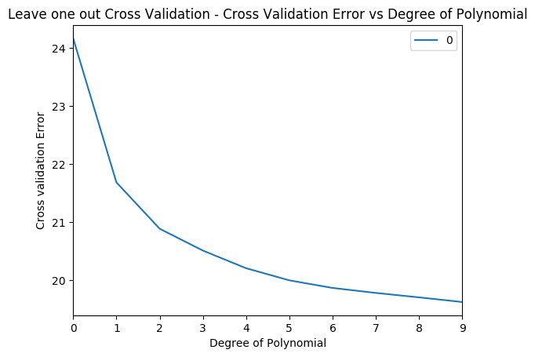

```{r}
library(dplyr)
library(caret)
library(e1071)
source('RFunctions-1.R')
```

```{r}
cancer <- read.csv("cancer.csv")
names(cancer) <- c(seq(1,30),"output")
train_idx <- trainTestSplit(cancer,trainPercent=75,seed=5)
train <- cancer[train_idx, ]
test <- cancer[-train_idx, ]

fit=glm(output~.,family=binomial,data=train,control = list(maxit = 50))
a=predict(fit,newdata=train,type="response")
b=ifelse(a>0.5,1,0)
confusionMatrix(b,train$output)


m=predict(fit,newdata=test,type="response")
n=ifelse(m>0.5,1,0)
confusionMatrix(n,test$output)
```

```{python}
import numpy as np
import pandas as pd
import os
import matplotlib.pyplot as plt
from sklearn.model_selection import train_test_split
from sklearn.linear_model import LogisticRegression
os.chdir("C:\\Users\\Ganesh\\RandPython")
from sklearn.datasets import make_classification, make_blobs

from sklearn.metrics import confusion_matrix
from matplotlib.colors import ListedColormap
from sklearn.datasets import load_breast_cancer
(X_cancer, y_cancer) = load_breast_cancer(return_X_y = True)
X_train, X_test, y_train, y_test = train_test_split(X_cancer, y_cancer,
                                                   random_state = 0)
clf = LogisticRegression().fit(X_train, y_train)
fig, subaxes = plt.subplots(1, 1, figsize=(7, 5))
clf = LogisticRegression().fit(X_train, y_train)


print('Accuracy of Logistic regression classifier on training set: {:.2f}'
     .format(clf.score(X_train, y_train)))
print('Accuracy of Logistic regression classifier on test set: {:.2f}'
     .format(clf.score(X_test, y_test)))
y_predicted=clf.predict(X_test)
confusion = confusion_matrix(y_test, y_predicted)
from sklearn.metrics import accuracy_score, precision_score, recall_score, f1_score
# Accuracy = TP + TN / (TP + TN + FP + FN) (All positives/(All))
# Precision = TP / (TP + FP) Ratio of True of positives among all positives
# Recall = TP / (TP + FN)  Also known as sensitivity, or True Positive Rate  (True positive)/()
# F1 = 2 * Precision * Recall / (Precision + Recall) 
print('Accuracy: {:.2f}'.format(accuracy_score(y_test, y_predicted)))
print('Precision: {:.2f}'.format(precision_score(y_test, y_predicted)))
print('Recall: {:.2f}'.format(recall_score(y_test, y_predicted)))
print('F1: {:.2f}'.format(f1_score(y_test, y_predicted)))
```


```{r}
library(dummies)
df <- read.csv("adult1.csv",stringsAsFactors = FALSE,na.strings = c(""," "," ?"))

# Remove rows which have NA
df1 <- df[complete.cases(df),]
dim(df1)

adult <- df1 %>% dplyr::select(age,occupation,education,educationNum,capitalGain,
                               capital.loss,hours.per.week,native.country,salary)

adult1 <- dummy.data.frame(adult, sep = ".")

train_idx <- trainTestSplit(adult1,trainPercent=75,seed=1111)
train <- adult1[train_idx, ]
test <- adult1[-train_idx, ]


fit=glm(salary~.,family=binomial,data=train)
a=predict(fit,newdata=train,type="response")
b=ifelse(a>0.5,1,0)
confusionMatrix(b,train$salary)


m=predict(fit,newdata=test,type="response")
n=ifelse(m>0.5,1,0)
confusionMatrix(n,test$salary)

```

```{python}
import numpy as np
import pandas as pd
import os
import matplotlib.pyplot as plt
from sklearn.model_selection import train_test_split
from sklearn.linear_model import LogisticRegression
from sklearn.metrics import confusion_matrix
from sklearn.metrics import accuracy_score, precision_score, recall_score, f1_score
df =pd.read_csv("adult1.csv",encoding="ISO-8859-1",na_values=[""," "," ?"])
df1=df.dropna()
print(df1.shape)
adult = df1[['age','occupation','education','educationNum','capitalGain','capital-loss', 
             'hours-per-week','native-country','salary']]

X=adult[['age','occupation','education','educationNum','capitalGain','capital-loss', 
             'hours-per-week','native-country']]
X_adult=pd.get_dummies(X,columns=['occupation','education','native-country'])
y=adult['salary']

X_adult_train, X_adult_test, y_train, y_test = train_test_split(X_adult, y,
                                                   random_state = 0)
clf = LogisticRegression().fit(X_adult_train, y_train)


print('Accuracy of Logistic regression classifier on training set: {:.2f}'
     .format(clf.score(X_adult_train, y_train)))
print('Accuracy of Logistic regression classifier on test set: {:.2f}'
     .format(clf.score(X_adult_test, y_test)))
y_predicted=clf.predict(X_adult_test)
confusion = confusion_matrix(y_test, y_predicted)
print('Accuracy: {:.2f}'.format(accuracy_score(y_test, y_predicted)))
print('Precision: {:.2f}'.format(precision_score(y_test, y_predicted)))
print('Recall: {:.2f}'.format(recall_score(y_test, y_predicted)))
print('F1: {:.2f}'.format(f1_score(y_test, y_predicted)))
```

```{r}
# Remove rows which have NA
df1 <- df[complete.cases(df),]
dim(df1)

adult <- df1 %>% dplyr::select(age,occupation,education,educationNum,capitalGain,
                               capital.loss,hours.per.week,native.country,salary)

adult1 <- dummy.data.frame(adult, sep = ".")

train_idx <- trainTestSplit(adult1,trainPercent=75,seed=1111)
train <- adult1[train_idx, ]
test <- adult1[-train_idx, ]
train.X <- train[,1:76]
train.y <- train[,77]
test.X <- test[,1:76]
test.y <- test[,77]

cMat <- NULL
neighbors <-c(1,3,5,10,15)
for(i in seq_along(neighbors)){
    fit =knn(train.X,test.X,train.y,k=i)
    table(fit,test.y)
    a<-confusionMatrix(fit,test.y)
    cMat[i] <- a$overall[1]
    print(a$overall[1])
    #print(a$byClass)
}

df <- data.frame(neighbors,Accuracy=cMat)
ggplot(df,aes(x=neighbors,y=Accuracy)) + geom_point() +geom_line(color="blue") +
    xlab("Number of neighbors") + ylab("Accuracy") +
    ggtitle("KNN regression - Accuracy vs Number of Neighors (Unnormalized)")
```


```{python}
import numpy as np
import pandas as pd
import os
import matplotlib.pyplot as plt
from sklearn.model_selection import train_test_split
from sklearn.metrics import confusion_matrix
from sklearn.metrics import accuracy_score, precision_score, recall_score, f1_score
from sklearn.neighbors import KNeighborsClassifier
from sklearn.preprocessing import MinMaxScaler

df =pd.read_csv("adult1.csv",encoding="ISO-8859-1",na_values=[""," "," ?"])
df1=df.dropna()
print(df1.shape)
adult = df1[['age','occupation','education','educationNum','capitalGain','capital-loss', 
             'hours-per-week','native-country','salary']]

X=adult[['age','occupation','education','educationNum','capitalGain','capital-loss', 
             'hours-per-week','native-country']]
X_adult=pd.get_dummies(X,columns=['occupation','education','native-country'])
y=adult['salary']

X_adult_train, X_adult_test, y_train, y_test = train_test_split(X_adult, y,
                                                   random_state = 0)
scaler = MinMaxScaler()
X_train_scaled = scaler.fit_transform(X_adult_train)
# Apply scaling to test set also
X_test_scaled = scaler.transform(X_adult_test)
knn = KNeighborsClassifier(n_neighbors = 5)
knn.fit(X_train_scaled, y_train)
print('Accuracy of K-NN classifier on training set: {:.2f}'
     .format(knn.score(X_train_scaled, y_train)))
print('Accuracy of K-NN classifier on test set: {:.2f}'
     .format(knn.score(X_test_scaled, y_test)))
accuracy=[]
neighbors=[1,3,5,10,15]
for i in neighbors:
    knn = KNeighborsClassifier(n_neighbors = i)
    knn.fit(X_train_scaled, y_train)
    accuracy.append(knn.score(X_test_scaled, y_test))
    print('Accuracy test score: {:.3f}'
        .format(knn.score(X_test_scaled, y_test)))
        
fig=plt.plot(neighbors,accuracy)
fig=plt.title("KNN regression - Accuracy vs Number of neighbors")
fig=plt.xlabel("Neighbors")
fig=plt.ylabel("Accuracy")
fig.figure.savefig('foo1.png', bbox_inches='tight')
```

Output image:


```{r}
df=read.csv("auto_mpg.csv",stringsAsFactors = FALSE) # Data from UCI
df1 <- as.data.frame(sapply(df,as.numeric))

df2 <- df1 %>% dplyr::select(cylinder,displacement, horsepower,weight, acceleration, year,mpg)
df3 <- df2[complete.cases(df2),]
ggplot(df3,aes(x=horsepower,y=mpg)) + geom_point() + xlab("Horsepower") + 
    ylab("Miles Per gallon") + ggtitle("Miles per Gallon vs Hosrsepower")
```


```{python}
autoDF =pd.read_csv("auto_mpg.csv",encoding="ISO-8859-1")
autoDF.shape
autoDF.columns
autoDF1=autoDF[['mpg','cylinder','displacement','horsepower','weight','acceleration','year']]
autoDF2 = autoDF1.apply(pd.to_numeric, errors='coerce')
autoDF3=autoDF2.dropna()
autoDF3.shape
#X=autoDF3[['cylinder','displacement','horsepower','weight']]
X=autoDF3[['horsepower']]
y=autoDF3['mpg']

plt.scatter(X,y)
plt.show()
```

```{r}
set.seed(17)
df=read.csv("auto_mpg.csv",stringsAsFactors = FALSE) # Data from UCI
df1 <- as.data.frame(sapply(df,as.numeric))

df2 <- df1 %>% dplyr::select(cylinder,displacement, horsepower,weight, acceleration, year,mpg)
df3 <- df2[complete.cases(df2),]
a=matrix(rep(0,30),nrow=3,ncol=10)
set.seed(17)
folds<-c(4,5,10)
for(i in seq_along(folds)){
    cv.error.10=rep(0,10)
    for (j in 1:10){
        glm.fit=glm(mpg~poly(horsepower,j),data=df3)
        #cv.error=cv.glm(Auto,glm.fit,K=i)$delta[1]
        a[i,j]=cv.glm(Auto,glm.fit,K=folds[i])$delta[1]
        
    }
    
}


b <- t(a)
df <- data.frame(b)
df1 <- cbind(seq(1,10),df)
names(df1) <- c("PolynomialDegree","4-fold","5-fold","10-fold")

df2 <- melt(df1,id="PolynomialDegree")
ggplot(df2) + geom_line(aes(x=PolynomialDegree, y=value, colour=variable),size=2) 
"

```


```{python}
import numpy as np
import pandas as pd
import os
import matplotlib.pyplot as plt
from sklearn.linear_model import LinearRegression
from sklearn.cross_validation import train_test_split, KFold
from sklearn.preprocessing import PolynomialFeatures
from sklearn.metrics import mean_squared_error
autoDF =pd.read_csv("auto_mpg.csv",encoding="ISO-8859-1")
autoDF.shape
autoDF.columns
autoDF1=autoDF[['mpg','cylinder','displacement','horsepower','weight','acceleration','year']]
autoDF2 = autoDF1.apply(pd.to_numeric, errors='coerce')
autoDF3=autoDF2.dropna()
autoDF3.shape
#X=autoDF3[['cylinder','displacement','horsepower','weight']]
X=autoDF3[['horsepower']]
y=autoDF3['mpg']

# For degreee 
def computeCVError(X,y,folds):
    deg=[]
    mse=[]
    degree1=[1,2,3,4,5,6,7,8,9,10]
    
    nK=len(X)/float(folds)
    xval_err=0
    for j in degree1: 
        kf = KFold(len(X),n_folds=folds)
        for train_index, test_index in kf:
            X_train, X_test = X.iloc[train_index], X.iloc[test_index]
            y_train, y_test = y.iloc[train_index], y.iloc[test_index]  

            poly = PolynomialFeatures(degree=j)             
            X_train_poly = poly.fit_transform(X_train)
            X_test_poly = poly.fit_transform(X_test)
            linreg = LinearRegression().fit(X_train_poly, y_train)
            y_pred = linreg.predict(X_test_poly)            
            #test_mse = mean_squared_error(y_test, y_pred)*float(len(X_train))/float(len(X)) 
            #test_mse = mean_squared_error(y_test, y_pred)/float(len(X_train))
            #e=y_test-y_pred
            #xval_err = np.sum(np.dot(e,e))            
            #mse.append(xval_err/nK)
            test_mse = mean_squared_error(y_test, y_pred)*float(len(X_train))/float(len(X))          
            mse.append(test_mse)
            
        deg.append(np.mean(mse))
        
    return(deg)


df=pd.DataFrame()
for folds in [4,5,10]:
    cvError=computeCVError(X,y,folds)
    #print(cvError)
    df1=pd.DataFrame(cvError)
    df=pd.concat([df,df1],axis=1)
    #print(cvError)
    
df.columns=['4-fold','5-fold','10-fold']
df=df.reindex([1,2,3,4,5,6,7,8,9,10])
df
fig1=df.plot()
fig1.figure.savefig('foo2.png', bbox_inches='tight')
```


```{r}
library(boot)
df=read.csv("auto_mpg.csv",stringsAsFactors = FALSE) # Data from UCI
df1 <- as.data.frame(sapply(df,as.numeric))

df2 <- df1 %>% dplyr::select(cylinder,displacement, horsepower,weight, acceleration, year,mpg)
df3 <- df2[complete.cases(df2),]
cv.error=rep(0,5)
for (i in 1:10){
    glm.fit=glm(mpg~poly(horsepower,i),data=df3)
    cv.error[i]=cv.glm(Auto,glm.fit)$delta[1]
}
df=data.frame(degree=seq(1,10),CVError=cv.error)
ggplot(df,aes(x=degree,y=CVError)) +geom_point() + geom_line(color="blue") +
    ggtitle("LOOCV- Cross Validation Error vs Degree of Polynomial") +
    xlab("Degree") + ylab("Cross ValidationError")
```
```{python}
import numpy as np
import pandas as pd
import os
import matplotlib.pyplot as plt
from sklearn.linear_model import LinearRegression
from sklearn.cross_validation import train_test_split, KFold
from sklearn.preprocessing import PolynomialFeatures
from sklearn.metrics import mean_squared_error
autoDF =pd.read_csv("auto_mpg.csv",encoding="ISO-8859-1")
autoDF.shape
autoDF.columns
autoDF1=autoDF[['mpg','cylinder','displacement','horsepower','weight','acceleration','year']]
autoDF2 = autoDF1.apply(pd.to_numeric, errors='coerce')
autoDF3=autoDF2.dropna()
autoDF3.shape
#X=autoDF3[['cylinder','displacement','horsepower','weight']]
X=autoDF3[['horsepower']]
y=autoDF3['mpg']

# For degreee 
def computeCVError(X,y,folds):
    deg=[]
    mse=[]
    degree1=[1,2,3,4,5,6,7,8,9,10]
    
    nK=len(X)/float(folds)
    xval_err=0
    for j in degree1: 
        kf = KFold(len(X),n_folds=folds)
        for train_index, test_index in kf:
            X_train, X_test = X.iloc[train_index], X.iloc[test_index]
            y_train, y_test = y.iloc[train_index], y.iloc[test_index]  

            poly = PolynomialFeatures(degree=j)             
            X_train_poly = poly.fit_transform(X_train)
            X_test_poly = poly.fit_transform(X_test)
            linreg = LinearRegression().fit(X_train_poly, y_train)
            y_pred = linreg.predict(X_test_poly)            
            #test_mse = mean_squared_error(y_test, y_pred)*float(len(X_train))/float(len(X)) 
            #test_mse = mean_squared_error(y_test, y_pred)/float(len(X_train))
            #e=y_test-y_pred
            #xval_err = np.sum(np.dot(e,e))            
            #mse.append(xval_err/nK)
            test_mse = mean_squared_error(y_test, y_pred)*float(len(X_train))/float(len(X))          
            mse.append(test_mse)
            
        deg.append(np.mean(mse))
        
    return(deg)


df=pd.DataFrame()
print(len(X))
cvError=computeCVError(X,y,len(X))
 
df=pd.DataFrame(cvError)

fig1=df.plot()
fig1.figure.savefig('foo3.png', bbox_inches='tight')
```

